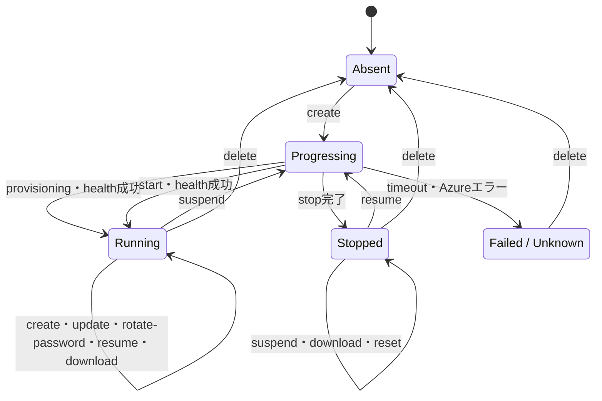

# Azure Container Apps 複数利用者運用

利用者ごとにURL、パスワード、永続領域が独立したcode-serverを管理します。1つのAppを
複数replicaへ増やす構成ではなく、利用者ごとにContainer Appを1つ作成します。

## リソース構成

| リソース | 共有または分離 | 命名例 |
|---|---|---|
| Resource Group / ACR / image | 共有 | `rg-code-server` / `code-server-ol8:<tag>` |
| Container Apps Environment | 共有 | `cae-code-server` |
| ACR pull用Managed Identity | 共有 | `id-code-server-acrpull` |
| Storage Account | 共有 | `stcodeserver<suffix>` |
| Container App / FQDN | 利用者ごと | `code-server-ol8-alice` |
| init Job (Manual trigger) | 利用者ごと | `code-server-ol8-alice-init` |
| Container Apps Secret | 利用者ごと | `code-server-password` |
| Azure Files Share | 利用者ごと | `code-server-alice` |
| ローカルパスワード | 利用者ごと | `$HOME/.azure/code-server-aca/instances/alice/password` |

各Share内の`home`を`/home/user`、`workspace`を`/workspace`へマウントします。

## 共有基盤の確認

[Azure Container Apps公開・運用](azure-container-apps-publish.md)に従って共有基盤と
イメージを準備します。

```bash
./aca-environment.sh doctor
./aca-instance.sh doctor
```

Azure CLIの通常警告は抑制されます。診断時だけ再表示する場合は次を使用します。

```bash
AZURE_CORE_ONLY_SHOW_ERRORS=false ./aca-instance.sh doctor
```

## インスタンスの作成

スラッグには英小文字、数字、単一のハイフンを使用します。

```bash
./aca-instance.sh create alice
./aca-instance.sh create bob
```

`create`は次を冪等に実行します。

1. mode 600の一意なパスワードを生成する。
2. 個別File Shareと`home`、`workspace`を作成する。
3. Container Apps Environmentへ個別ストレージを登録する。
4. 専用のinit Jobを実行し、`home`へ既定設定・拡張機能を事前に導入する(後述)。
5. App固有SecretとHTTPS ingressを持つContainer Appを作成する。
6. Single revision、`min=1`、`max=1`へ設定する。
7. `/healthz`成功後にURLとパスワードを表示する。

既存Appがあるのにローカルパスワードファイルがない場合は、Secretを上書きせずエラーに
します。

## URLとパスワード

```bash
./aca-instance.sh list
./aca-instance.sh show alice
```

`list`と`show`はパスワードを平文表示します。画面共有、CIログ、シェルトレースを有効に
した端末では実行しないでください。

出力の`PROVISIONING`列はAzureリソースの作成・更新状態、`RUNNING`列はAppの実行状態を
表します。通常の稼働状態は`Succeeded / Running`、休止状態は`Succeeded / Stopped`です。

## ライフサイクルと受付可能な操作

Container Appの実行状態は次のように遷移します。`suspend`と`resume`だけが明示的に
RunningとStoppedを切り替えます。他のコマンドが停止中のAppを暗黙に起動することは
ありません。



各状態で受付可能なコマンドは次のとおりです。`delete`は障害状態からの回復にも必要な
ため、スラッグの完全一致確認後であれば全状態から実行できます。

| 状態 | 受付可能なコマンド | 拒否する主なコマンド |
|---|---|---|
| Appなし | `create` | その他のインスタンス操作 |
| Running / Succeeded | `create`, `update`, `rotate-password`, `suspend`, `resume`, `download`, `show`, `delete` | なし |
| Stopped / Succeeded | `suspend`, `resume`, `download`, `reset`, `show`, `delete` | `create`, `update`, `rotate-password` |
| Progressing | `show`, `list`, `delete` | その他の変更操作 |
| Failed / Unknown | `show`, `list`, `delete` | その他の変更操作 |

`list`は特定Appの状態にかかわらず常に実行できます。変更操作の前には
`properties.provisioningState`と`properties.runningStatus`を確認します。遷移中や未知の
状態では処理を行わず、状態を確認してからの再実行を促します。

## 休止と再開

未利用時にレプリカを停止します。

```bash
./aca-instance.sh suspend alice
```

`Succeeded / Stopped`になるまで最大300秒待機します。既にStoppedの場合はREST操作を
重複実行せず、現在の状態を表示して正常終了します。再開する場合は次を実行します。

```bash
./aca-instance.sh resume alice
```

`Succeeded / Running`への遷移後、`/healthz`が成功してから完了します。既にRunningの
場合はstartを重複実行せずhealth checkだけを行います。両コマンドの結果にはパスワードを
表示しません。

停止・開始にはContainer Appsのstable REST API `2025-07-01`を`az rest`経由で使用します。
`az containerapp job start/stop`はContainer Apps Job用であり、通常のAppには使用しません。
ここで言うJobは通常Appの起動・停止遷移とは無関係で、後述する「init Job」(`create`/`reset`
時にhomeへ既定設定・拡張機能を事前導入する一度きりのJob)を指します。init Jobは
`az containerapp job start`で実行しますが、これはAppのRunning/Stopped遷移をJobで代替する
ものではありません。

suspend中もURL、Secret、Azure Files Share、`min=1` / `max=1`の設定は維持されます。
レプリカが0の間はContainer Appsのリソース消費課金は発生しませんが、ACRの日次料金、
Azure Filesの保存データ・トランザクション、Log Analyticsの取り込み・保持など、共有
リソースの料金は継続し得ます。

## 永続データのダウンロード

Azure Files Shareにある`home`と`workspace`を、ローカルのtar.gzへ書き出します。

```bash
# カレントディレクトリへ alice-<UTC時刻>.tar.gz を作成
./aca-instance.sh download alice

# 指定ディレクトリへ既定名で作成
./aca-instance.sh download alice ./backups/

# 出力ファイル名を指定
./aca-instance.sh download alice ./backups/alice-before-update.tar.gz
```

出力先ディレクトリは事前に作成してください。既存ファイルとシンボリックリンクは
上書きしません。完成したアーカイブはmode 600で、直下に`home/`と`workspace/`を含みます。
処理中の一時ファイルは失敗時にも削除され、完全なアーカイブだけが指定先に確定します。

`download`は`Succeeded / Running`と`Succeeded / Stopped`で利用できます。稼働中でも
実行できますが、書き込みと同時に取得するとファイル間で時点がずれる可能性があります。
整合した退避が必要な場合は先に`suspend`し、ダウンロード後に必要なら`resume`してください。

ストレージキーは一時的な環境変数としてAzure CLIへ渡し、コマンド引数や出力には表示
しません。アーカイブはAzure Filesの論理的なファイル内容のエクスポートであり、Shareの
snapshot、ACL、Azure固有メタデータを完全に復元するバックアップではありません。

## 永続データの初期化

停止中の利用者環境を完全に初期化する場合は、必要なデータを先にダウンロードします。

```bash
./aca-instance.sh suspend alice
./aca-instance.sh download alice ./backups/
./aca-instance.sh reset alice
# 確認プロンプトへ: reset alice
./aca-instance.sh resume alice
```

`reset`は`Succeeded / Stopped`でのみ受け付け、File Share内の`home`と`workspace`を
再帰的に削除して空ディレクトリとして再作成します。App、URL、Password Secret、ローカルの
passwordファイル、File Share自体は変更せず、処理後もStoppedのままです。自動バックアップは
行わず、実行には`reset <slug>`の完全一致確認が必要です。

空ディレクトリの再作成に続けて、`reset`は専用のinit Job(`<App名>-init`)を実行し、
イメージ内VSIXから初期拡張機能を導入・検証し、既定の`settings.json`を配置します。
Azure Files(SMB)は拡張機能の再展開にローカルディスクより時間がかかり、Container Apps
の既定startup probe猶予を超えるとAppがCrashLoopBackOffになるため、ingress・startup probe
付きのAppを起動する前に、この初期化を完了させておきます。init Jobが失敗した場合は
`reset`自体がエラー終了し、Appは初期化未完了のままStoppedを維持します(次回`resume`は
実行しないでください。原因を解消して`reset`を再実行します)。init Job成功後の`resume`は
既にdefaultsが揃った状態でAppを起動するだけなので高速です。作業ツリーの
`src/code-server-defaults`を直接参照する処理ではないため、未公開の変更は反映されません。

init Jobの実行時間は拡張機能の数とAzure FilesのI/O速度に依存し、実測では拡張1件あたり
1〜2分程度、17件で15分前後かかることがあります。`reset`はJobの完了を最大30分
(`replicaTimeout`と同じ)待機します。ローカルのpodman(ローカルディスク)では同じ処理が
数十秒で終わるため、この差はAzure Files固有の制約です。

Azure Filesの削除・再作成はトランザクションではありません。途中で失敗した場合もAppは
Stoppedのままなので、エラー原因を解消して同じ`reset`を再実行してください。

## イメージ更新

`aca-environment.sh publish`後、対象Appを更新します。

```bash
./aca-instance.sh update alice
./aca-instance.sh update bob
```

更新後もSecret、File Share、URLは維持されます。新RevisionがHealthyになったことを
確認してから次の利用者を更新します。

StoppedのAppは`update`を受け付けません。明示的に`resume`してhealthを確認してから
`update`し、更新検証後も休止させる場合は再度`suspend`します。停止中Appが旧imageを
参照している間は、そのACR imageを削除しないでください。

## パスワードのローテーション

```bash
./aca-instance.sh rotate-password alice
```

新しい一意なパスワードを生成し、App Secretとローカルファイルを更新してActive
Revisionを再起動します。

## 受け入れ確認

- 利用者ごとにURLとパスワードが異なる。
- 各パスワードでは対応するAppだけにログインできる。
- `/home/user`と`/workspace`が相互に分離される。
- Revision再起動後も設定とファイルが保持される。
- 各AppがSingle revision、`min=1`、`max=1`である。
- 稼働対象は`Succeeded / Running`、休止対象は`Succeeded / Stopped`である。

認証をCLIで確認する場合、正しいパスワードを`/login`へPOSTすると302になります。
別利用者のパスワードでは認証されず、ログイン画面の200になります。パスワード値は
コマンド出力やログへ残さないでください。

永続化と分離は、各`/workspace`へ利用者固有markerを作り、Revision再起動後に自身の
markerだけが存在することで確認できます。`az containerapp exec`は対話TTYが必要になる
環境があります。また、短時間に繰り返すと429と`retry-after`が返るため、設定・拡張・
markerを少数の接続で確認します。停止中replicaへの接続で500になった場合は、Revisionが
Healthyかつ`RunningAtMaxScale`であることを確認してから再試行します。

## インスタンスの削除

```bash
./aca-instance.sh delete alice
```

スラッグの再入力後、Container App、init Job、環境ストレージ登録、File Share、
ローカルパスワードを削除します。Azure側の削除が失敗した場合はパスワードファイルを
保持します。

共有Resource Group全体の削除は`aca-environment.sh delete`を使用します。

## ローカル環境との関係

AzureのスラッグはローカルPodmanのインスタンス番号から独立しています。
`aca-instance.sh`はローカルコンテナと`./storage`を変更しません。

## 参考資料

- [Container Apps - Start REST API](https://learn.microsoft.com/rest/api/resource-manager/containerapps/container-apps/start?view=rest-resource-manager-containerapps-2025-07-01)
- [Container Apps - Stop REST API](https://learn.microsoft.com/rest/api/resource-manager/containerapps/container-apps/stop?view=rest-resource-manager-containerapps-2025-07-01)
- [Azure Container Appsの課金](https://learn.microsoft.com/azure/container-apps/billing)
