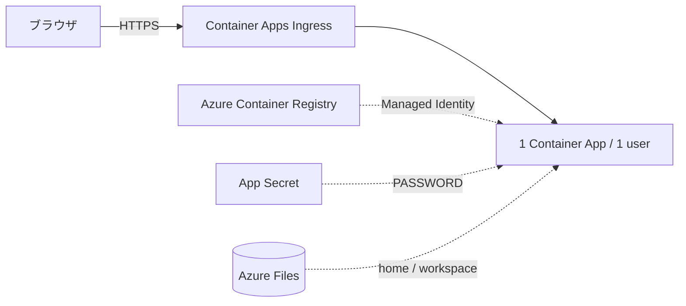
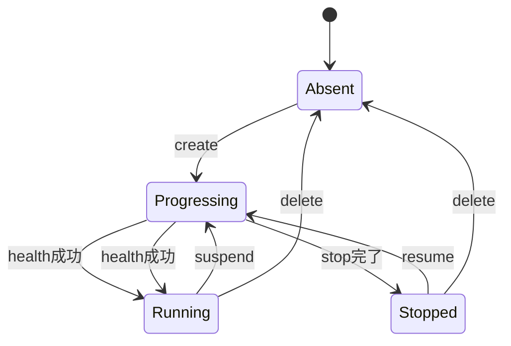

# Azure Container Apps 公開・運用

rootless Podmanでビルドした`code-server-ol8`をAzure Container Registryへ登録し、
利用者ごとに分離したAzure Container Appsとして公開します。

## アーキテクチャ



共有Resource Groupには次を配置します。

- Basic SKUのACR
- Standard_LRSのStorage Account
- ACR pull用Managed Identity
- Container Apps EnvironmentとLog Analytics Workspace
- 利用者ごとのContainer App、Secret、File Share

管理可能な共有リソースには`application=code-server`、`environment=production`、
`managed-by=aca-environment.sh`タグを設定します。

## 前提条件

- Azure CLIへログイン済みで、対象Subscriptionが選択されている。
- Resource Group、ロール割り当て、ACR、Storage、Container Appsを作成できる。
- rootless Podman、OpenSSL、curl、jq、tar、sha256sumが利用できる。
- `ghcr.io`とOpen VSXへ接続できる。
- 配置先は設定ファイルの`LOCATION`で指定する。既定値は`japaneast`。

```bash
az login --use-device-code
az account show --output table
az extension add --name containerapp --upgrade
```

## 1. ローカル設定の初期化

```bash
./aca-environment.sh init
```

既定では`$HOME/.azure/code-server-aca.env`をmode 600で作成し、グローバルに一意である
必要があるACRとStorage Account用の6文字suffixを生成します。既存ファイルは上書き
しません。別の設定ファイルを使う場合は全管理コマンドへ指定します。

```bash
./aca-environment.sh --config /path/to/config.env init
```

設定の主要値は次のとおりです。

```text
RESOURCE_GROUP=rg-code-server
LOCATION=japaneast
ENVIRONMENT_NAME=cae-code-server
IDENTITY_NAME=id-code-server-acrpull
IMAGE_REPOSITORY=code-server-ol8
CONTAINER_APP_CPU=4.0
CONTAINER_APP_MEMORY=8Gi
SCALING_MODE=disabled
SCALING_MIN_REPLICAS=0
SCALING_COOLDOWN_PERIOD=3600
```

Secretとパスワードはこのファイルに保存しません。
CPU・memoryとスケーリング値はSecretではなく、次回の`create`/`update`で使う目標設定です。
既存configにCPU・memoryがない場合も、Appには`4.0 vCPU / 8Gi`を適用します。init Jobは
`1.0 vCPU / 2Gi`のままです。

## 2. 共有基盤の作成

```bash
./aca-environment.sh create
```

必要なResource Providerを登録し、共有リソースと`AcrPull`ロールを冪等に作成します。
途中で失敗した場合は同じコマンドを再実行します。

```bash
./aca-environment.sh doctor
```

`doctor`はSubscription、Resource Group、ACR、Identity、Storage、Environment、設定済み
イメージを読み取り確認します。

## 3. イメージの公開

```bash
./aca-environment.sh publish

./aca-environment.sh publish --scaling-mode enabled \
    --min-replicas 0 --cooldown-period 3600
```

このコマンドは次を実行します。

1. `build-pod.sh`で`code-server-ol8`をビルドする。
2. `verify-defaults.sh`でネットワークなしの起動検証を行う。
3. `src`の内容ハッシュを含む不変タグを生成する。
4. ACRの短期アクセストークンでrootless Podmanからpushする。
5. ACR上のdigestを確認し、設定ファイルの`IMAGE_TAG`とスケーリング設定を原子的に更新する。

`publish`は既存Appを変更しません。外部configのCPU・memoryと保存したスケーリング設定は
新規`create`と、後続の利用者別`update`で
順次反映します。オプション省略時は設定ファイルの現在値を維持し、旧設定ファイルでは
後方互換の`disabled`を使用します。

`build-pod.sh`は
`ghcr.io/hondarer/oracle-linux-container/oracle-linux-8-dev:latest`を毎回pullします。
取得したdigestをそのbuild内で固定し、完成イメージの
`org.opencontainers.image.base.name`と`org.opencontainers.image.base.digest`ラベルへ
記録します。このため兄弟リポジトリやローカルで事前buildしたベースイメージには依存
しません。

ACRへ登録するcode-serverイメージには`latest`タグを使用しません。GHCRのベース
`latest`はbuildごとに変化し得ますが、完成イメージは不変タグ、image digest、base
digestラベルで追跡できます。公開結果は標準出力へ表示し、Git管理文書には固定値を記録
しません。

GHCRベースやACRが空の場合は大きなレイヤーを転送するため、初回pullと初回pushには
数分かかることがあります。進捗表示が止まって見えてもプロセスを重ねて起動せず、完了
または明示的なエラーを待ちます。

## 4. 利用者Appの作成

```bash
./aca-instance.sh create alice
./aca-instance.sh create bob
./aca-instance.sh list
```

詳細は[複数利用者運用](azure-container-apps-multi-instance.md)を参照してください。

## インスタンスの実行状態

各Appの実行状態は個別に管理します。停止中もURL、Secret、Azure Files、Single revision、
スケーリング設定は保持されます。



```bash
./aca-instance.sh suspend alice
./aca-instance.sh resume alice
```

受付可能なコマンドは次のとおりです。詳細な状態遷移、エラー時の扱い、課金上の注意は
[複数利用者運用のライフサイクル仕様](azure-container-apps-multi-instance.md#ライフサイクルと受付可能な操作)
を正本とします。

| 状態 | 受付可能なコマンド | 拒否する主なコマンド |
|---|---|---|
| Appなし | `create` | その他のインスタンス操作 |
| Running / Succeeded | `create`, `update`, `rotate-password`, `suspend`, `resume`, `download`, `show`, `delete` | なし |
| Stopped / Succeeded | `suspend`, `resume`, `download`, `reset`, `show`, `delete` | `create`, `update`, `rotate-password` |
| Progressing | `show`, `list`, `delete` | その他の変更操作 |
| Failed / Unknown | `show`, `list`, `delete` | その他の変更操作 |

StoppedのAppをリリース対象にする場合は`resume`、`update`、動作確認、必要なら`suspend`の
順に実行します。停止中Appが旧imageを参照している間は、そのACR imageを削除しません。
レプリカが0の間はContainer Appsのリソース消費課金は発生しませんが、ACR、Azure Files、
Log Analyticsなどの関連料金は継続し得ます。

リリース前の永続データ退避には`./aca-instance.sh download <slug> [PATH]`を使用できます。
更新と同時の書き込みを避ける必要がある場合は、`suspend`、`download`、`resume`、`update`
の順に行います。出力形式と制約は[複数利用者運用の永続データのダウンロード](azure-container-apps-multi-instance.md#永続データのダウンロード)
を参照してください。

利用者環境全体を初期化する`reset`はStoppedでのみ実行できます。必要なら先に`download`し、
`reset`後の`resume`で現在のAppイメージに同梱された既定設定と拡張機能を再適用します。
詳細は[複数利用者運用の永続データの初期化](azure-container-apps-multi-instance.md#永続データの初期化)
を参照してください。

## 5. 更新

新しいイメージを公開し、利用者を1人ずつ更新します。

```bash
./aca-environment.sh publish
./aca-instance.sh update alice
./aca-instance.sh update bob
```

各更新後にURLへログインし、RevisionがHealthyかつトラフィック100%であることを確認して
から次へ進みます。不要なACRタグを削除する場合は、すべてのAppが新しいdigestを使用して
いることを先に確認します。

Single revision modeでも更新直後は旧Revisionが一時的にActive、traffic 0、
Deprovisioningと表示される場合があります。新RevisionがHealthy、
`RunningAtMaxScale`、traffic 100%になり、旧Revisionが停止してから更新完了とします。

```bash
source "$HOME/.azure/code-server-aca.env"
az acr repository show-tags \
    --name "$ACR_NAME" \
    --repository "$IMAGE_REPOSITORY" \
    --orderby time_desc \
    --detail \
    --output table
```

## 6. 監査

```bash
./aca-environment.sh doctor
./aca-instance.sh list

source "$HOME/.azure/code-server-aca.env"
az resource list --resource-group "$RESOURCE_GROUP" --output table
az containerapp list \
    --resource-group "$RESOURCE_GROUP" \
    --query '[].{name:name,fqdn:properties.configuration.ingress.fqdn,image:properties.template.containers[0].image,cpu:properties.template.containers[0].resources.cpu,memory:properties.template.containers[0].resources.memory,provisioning:properties.provisioningState,running:properties.runningStatus,min:properties.template.scale.minReplicas,max:properties.template.scale.maxReplicas,cooldown:properties.template.scale.cooldownPeriod,rule:properties.template.scale.rules[0].name}' \
    --output table
```

受け入れ条件:

- Appごとに異なるHTTPS URLと一意なパスワードがある。
- 正しいパスワードだけが対応Appで認証される。
- 稼働対象はActive/HealthyなRevisionが1つで`Running`、休止対象は`Stopped`である。
- 全AppがSingle revision、`max=1`である。スケーリング無効時は`min=1`、有効時は
  設定したmin、cooldown、HTTP ruleである。
- 全AppのCPU・memoryが外部configの目標値であり、init Jobは`1.0 vCPU / 2Gi`である。
- `/home/user`と`/workspace`が利用者ごとのFile Shareへ永続化される。
- 再起動後もファイル、既定設定、拡張機能が保持される。
- HTTPはHTTPSへリダイレクトされる。

## 7. 削除

個別AppとそのFile Shareだけを削除します。

```bash
./aca-instance.sh delete alice
```

共有Resource Group全体を削除する場合は、Resource Group名の再入力が必要です。

```bash
./aca-environment.sh delete
```

ローカル設定と全利用者パスワードも削除する場合だけ、次を指定します。

```bash
./aca-environment.sh delete --purge-local-state
```

この操作でAzure Files内の全データも削除され、復元機能はありません。

Resource Group削除はContainer Apps EnvironmentとLog Analytics Workspaceを含むため、
数分以上`Deleting`になる場合があります。Azureが削除要求を受理した後にローカルの
待機を中断しても、Azure側の削除は取り消されません。`az group exists`とリソース一覧で
消失を確認してから同名環境を再作成します。

## トラブルシューティング

- Azure CLIの通常警告は管理CLIで抑制する。全警告を確認する場合は
  `AZURE_CORE_ONLY_SHOW_ERRORS=false`を付ける。
- `create`は冪等なため、タイムアウトや一時エラーの解消後に再実行できる。
- Container App作成直後はRevisionが`Activating`になる。`Healthy`になるまで待つ。
- `az containerapp exec`は対話TTYを必要とする実行環境がある。
- `az containerapp exec`を短時間に繰り返すと429になる場合がある。`retry-after`に従い、
  Revisionの状態を通常APIで確認してから再試行する。
- execが停止中replicaへ接続して500になった場合は、Healthyな稼働replicaを確認して
  revisionを明示する。
- Storage mountにはAzure Files SMB向けのUID/GIDと`mfsymlinks`を設定している。

## 参考資料

- [Managed IdentityによるACR pull](https://learn.microsoft.com/azure/container-apps/managed-identity-image-pull)
- [Container Apps ingress](https://learn.microsoft.com/azure/container-apps/ingress-overview)
- [Container Apps storage mounts](https://learn.microsoft.com/azure/container-apps/storage-mounts)
- [Azure Files Linux SMB](https://learn.microsoft.com/azure/storage/files/storage-how-to-use-files-linux)
- [ACR SKU](https://learn.microsoft.com/azure/container-registry/container-registry-skus)
